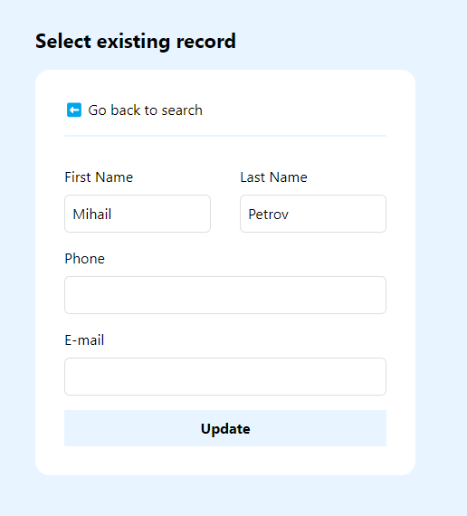

# ReactJs community portal - custom validation

If you are interested in how to integrate the Reltio API with custom validation service - this repository is 
the right choise for you.

## Introduction

In the evolving landscape of veterinary medicine, the need for streamlined and personalized customer experiences has become paramount. Our veterinary medical center is at the forefront of this transformation, committed to delivering exceptional care to our patients while ensuring a seamless and efficient interaction with their owners.

To achieve this, we are embarking on an exciting project to develop a custom customer portal tailored to the unique needs of our clientele. This portal will not only serve as a central hub for accessing pet health records, appointment scheduling, and communication with our veterinary team but will also incorporate advanced UI validation mechanisms to enhance data integrity and user experience.

To make this vision a reality, we will be integrating our customer portal with Reltio, a leading data management platform. This integration will allow us to securely access and validate pet records stored in Reltio's robust database, ensuring that our customers have accurate and up-to-date information at their fingertips.

In this code example, we will walk through the implementation of our custom customer portal, focusing specifically on the development of the UI validation features and the integration with Reltio. By following this example, you will gain insights into how to create a tailored customer portal that meets the unique requirements of a veterinary medical center, while leveraging the power of Reltio's data management capabilities.

The customer portal consist of two components:
- Login page
- Dashboard - for customer and patient managment

## Technologies and building blocks

The application is build using **ReactJS** on the front-end and consist of two types of validation services:
- Custom validation with regular expression and dictunary maps - whitch is primary used for validationg customer names
- [Loqate validation service](https://www.loqate.com/en-gb/) - an external service for validating a sensitive infromation like E-mail adresses, phone numbers and phisical adresses. The services provide a complex multy level check and not only validate the pattern of the adress but actialy check if a record is available inside the databases of the service providers (especialy for Phones and E-mail adresses).

This demo is integrated with Ulpia Tech personal test Reltio account consisting of the folowing models:
- Person
- Customer
- Patient
- Medical record

If you wish to integrate the code for your own perposes please provide a valid Reltio credentials and Loqate crendetials inside the **env** file.

## Application flow

The main flow of the application consist of the folowing steps:

### Login page

The user is presented with a login page to the portal. In this case we are using a Reltio authentication in order to log in insed the  app.

If at any moment the credentials are incorectly typed the Reltio is going to notify us with a coresponding message. 

### Dashboard page

The аьягфдьиа provide us with an ability to search and create a new user inside the system. 

## Conclusion